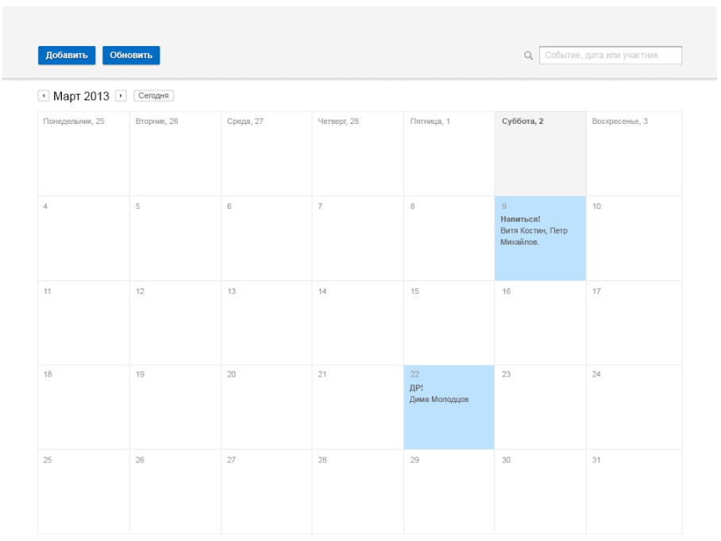

# Тестовое задание на позицию HTML-верстальщик / Junior Front-end Developer
### Что сделать

* Сверстать страницу календаря в соответствии с макетом ниже: календарь, кнопки, строка поиска, разные состояния ячеек (дней). Навигация по месяцами подразумевает автоматическое заполнение дат;
* Серверной части программировать не нужно, везде только верстка; 
Необходимо решить задание без использования сторонних JS/CSS-библиотек;
* Обязательно использование препроцессоров и инструментов сборки (Gulp или Webpack).

##### Пункт со звездочкой (сильно повысит вероятность успеха) 
Реализация навигации по месяцам на чистом JS: возможность переключать месяц по кнопкам ← / →.
Детали и нюансы на свое усмотрение. 

Результат выполнения задания разместить на GitHub в личном профиле.

